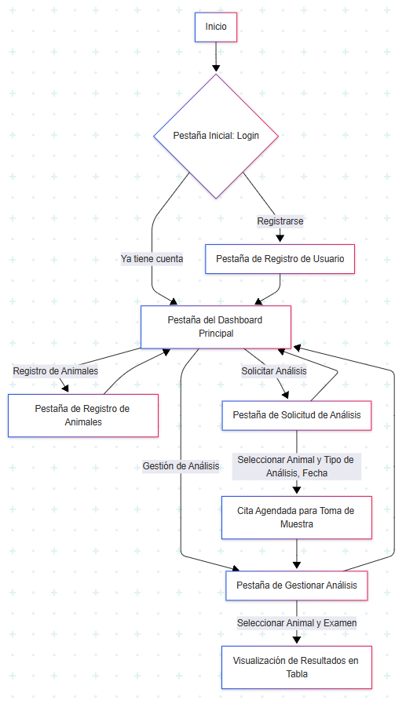
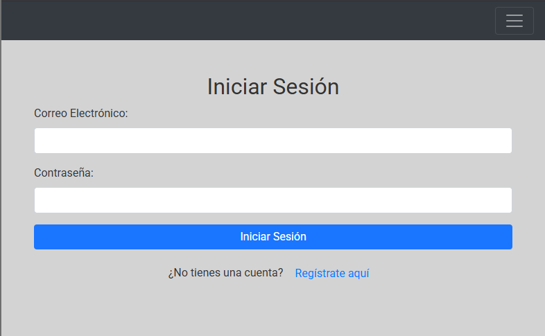
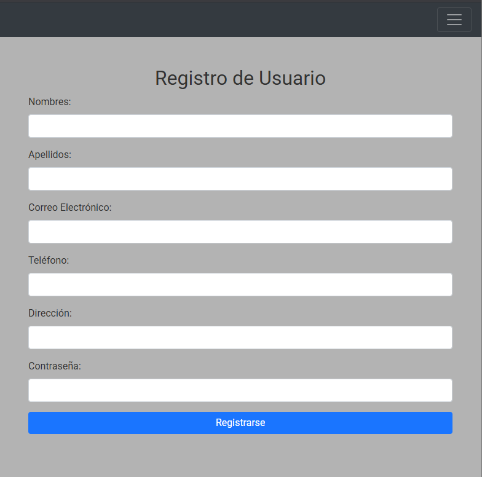
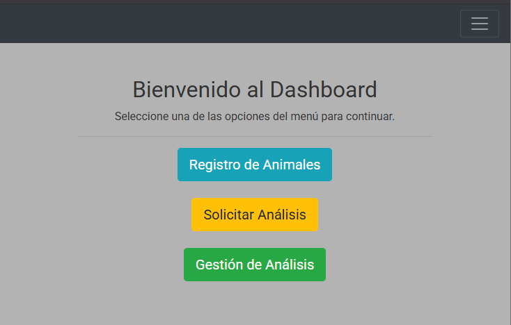
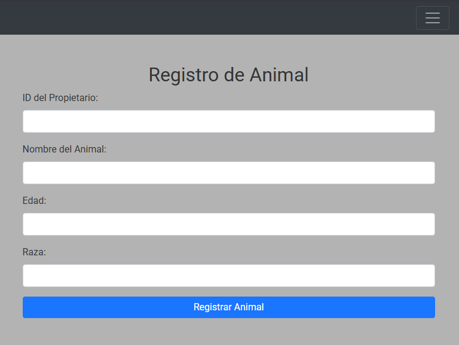
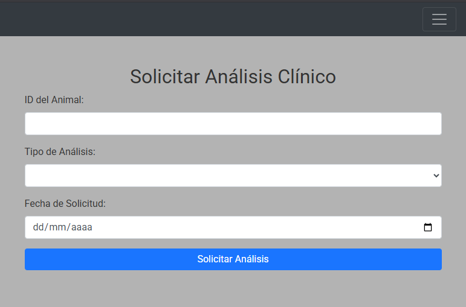
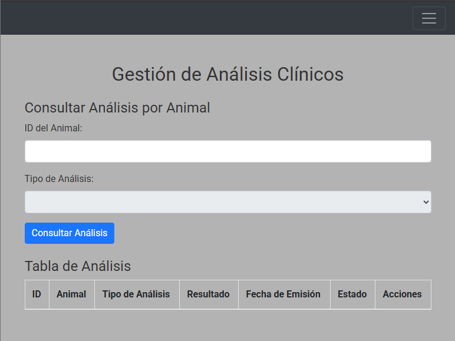

# Aplicación Web para la Gestión Integral de Servicios de Laboratorio Veterinario para Districampo

Este proyecto se enfoca en el desarrollo de una aplicación web para la gestión integral de servicios de laboratorio veterinario, diseñada para optimizar los procesos de diagnóstico en la Tienda Agropecuaria Districampo, ubicada en La Virginia, Risaralda. La solución busca mejorar la eficiencia y trazabilidad de los procesos diagnósticos.

## Problema Resuelto

La prestación de servicios veterinarios enfrenta obstáculos que dificultan la obtención de diagnósticos accesibles y rápidos, especialmente en áreas rurales como La Virginia, donde los desplazamientos generan demoras, costos elevados y riesgo de daño a las muestras. Además, existe una limitada integración tecnológica y de seguimiento en estos procedimientos.

Este proyecto propone una solución digital integral que permite programar la toma de muestras a domicilio, agilizar la coordinación con laboratorios aliados para el procesamiento y digitalizar la atención, ofreciendo una respuesta más rápida y cómoda para el usuario final.

## Justificación

La iniciativa surge de la necesidad de optimizar el método de análisis veterinario en áreas rurales, donde los servicios se enfrentan a problemas de logística, carencia de laboratorios equipados y poca tecnología para el manejo de muestras. La plataforma web facilitará la conexión entre la recolección de muestras a domicilio y su análisis en laboratorios asociados, centralizando el flujo de datos de manera intuitiva, rastreable y segura.

### Justificación Técnica
La aplicación busca transformar digitalmente cada etapa del procedimiento, desde el pedido de servicios hasta la presentación de los resultados, acortando los plazos de respuesta y mejorando el seguimiento e identificación de los especímenes.

## Alcance del Proyecto

El proyecto tiene como objetivo el diseño, desarrollo, validación e implementación de una aplicación web integral para la gestión de servicios de laboratorio veterinario digital.

La aplicación centralizará el proceso desde la solicitud del análisis clínico y la gestión de muestras, hasta la emisión de resultados en PDF.

### Funcionalidades Clave
**Listado detallado de funcionalidades principales:** La plataforma integrará las siguientes funcionalidades organizadas en módulos:

* **Módulo de Usuarios:** Registro, inicio de sesión y administración de datos personales.
* **Módulo de Mascotas:** Creación, edición y eliminación de registros de mascotas.
* **Módulo de Análisis:** Solicitud de servicios, seguimiento del estado de análisis, historial de exámenes.
* **Módulo de Resultados:** Carga y generación de reportes en formato PDF.

### Restricciones Técnicas, de Seguridad y de Rendimiento
* **Técnicas:** Aplicación web accesible solo vía navegador; uso de MySQL para base de datos; API RESTful para gestión de datos; generación de reportes con PDFKit; arquitectura modular.
* **Seguridad:** Necesidad de rutas protegidas (autenticación/autorización); cumplimiento de normativas legales para datos sensibles (anonimización); adherencia a protocolos de bioseguridad para muestras.
* **Rendimiento:** Tiempo óptimo de entrega de resultados (<24h); alta integridad de muestras (>95%).

### Casos de Uso Básicos
A continuación se describen los casos de uso principales para entender las interacciones básicas:

* **Registrar Nuevo Usuario:** Un usuario crea una cuenta para acceder a los servicios.
* **Iniciar Sesión:** Un usuario registrado accede a su panel personalizado.
* **Registrar Mascota:** Un propietario añade la información de su animal al sistema.
* **Solicitar Toma de Muestra a Domicilio:** Un propietario agenda una cita para recolección de muestras.
* **Consultar Estado de Análisis:** Un propietario verifica el progreso de sus muestras enviadas.
* **Ver Resultados de Análisis:** Un propietario accede a los informes digitales en PDF de los laboratorios.

## Arquitectura de Software y Boceto Inicial

### Diagrama General (Arquitectura en Capas)
La aplicación se basa en una arquitectura de software en capas para asegurar la modularidad, escalabilidad y una clara separación de responsabilidades. Una representación visual de esta arquitectura es la siguiente:



### Identificación de Módulos
Los módulos principales de la aplicación corresponden directamente a las funcionalidades clave descritas anteriormente (Usuarios, Mascotas, Análisis, Resultados, Administrativo), cada uno con su lógica de negocio y endpoints de API asociados.

## Mockups Iniciales y Flujo de Navegación

Se han desarrollado bocetos (mockups) iniciales de las pantallas clave de la aplicación, que incluyen:
* **Login**
* **Registro de Usuario**
* **Dashboard Principal**
* **Registro de Animales**
* **Solicitud de Análisis**
* **Gestión de Análisis**

Estos mockups en HTML con Bootstrap ya establecen el flujo de navegación básico de la aplicación, permitiendo una visualización de la interacción del usuario.

## Mockups Iniciales y Flujo de Navegación

Se han desarrollado bocetos (mockups) iniciales de las pantallas clave de la aplicación, que incluyen:
* **Login**
* **Registro de Usuario**
* **Dashboard Principal**
* **Registro de Animales**
* **Solicitud de Análisis**
* **Gestión de Análisis**

Estos mockups en HTML con Bootstrap ya establecen el flujo de navegación básico de la aplicación, permitiendo una visualización de la interacción del usuario.

### Vistas de la Interfaz de Usuario (Mockups Visuales)

A continuación, se presentan capturas de pantalla de las interfaces clave de la aplicación, mostrando el diseño y la interacción propuesta:

#### Vista de Inicio de Sesión


#### Vista de Registro de Usuario


#### Vista del Dashboard Principal


#### Vista de Registro de Animales


#### Vista de Solicitud de Análisis


#### Vista de Gestión de Análisis


Estos mockups en HTML con Bootstrap ya establecen el flujo de navegación básico de la aplicación, permitiendo una visualización de la interacción del usuario.

## Configuración del Entorno de Desarrollo y Repositorio

El proyecto está gestionado en un repositorio de GitHub, que sigue una estructura organizada para facilitar la colaboración y el mantenimiento.

### Repositorio y Estructura del Proyecto
El repositorio principal (`YOUR_REPO_NAME` en GitHub) contiene la siguiente estructura básica:
* `/backend/`: Código del servidor (Node.js/Express.js).
* `/frontend/`: Código del cliente (HTML, CSS, JavaScript, Bootstrap).
* `/docs/`: Documentación del proyecto, incluyendo:
    * `/docs/architecture/`: Diagramas de arquitectura y flujo (ej. `diagrama-captura.png`).
    * `/docs/database/`: Esquema de la base de datos (`schema.sql`).
* `.gitignore`: Para excluir archivos no deseados (como `node_modules/` o `.env`).
* `README.md`: Este archivo de descripción del proyecto.

### Dockerfile o Entorno de Desarrollo
Para el entorno de desarrollo, se espera que los desarrolladores tengan Node.js y MySQL instalados localmente. Las dependencias se gestionan a través de `package.json`. No se utiliza Dockerfile en esta fase inicial, pero la arquitectura modular facilita su futura incorporación.

## Estructura de la Base de Datos

La estructura completa de la base de datos se encuentra definida en el archivo `docs/database/schema.sql`. Este script contiene la definición de todas las tablas, sus columnas, tipos de datos, claves primarias y foráneas, y todas las restricciones necesarias para recrear la base de datos `veterilab2`.

## Tecnologías Utilizadas

* **Backend:** Node.js, Express.js (lógica de negocio y API)
* **Base de datos:** MySQL
* **Frontend:** HTML, CSS, JavaScript, Bootstrap
* **Generación de reportes PDF:** PDFKit
* **Consumo de API:** Axios
* **Control de versiones:** Git, GitHub
* **Entorno de desarrollo:** Visual Studio Code
* **Pruebas de API:** Postman
* **Despliegue:** AWS Lightsail (instancia básica)

## Configuración del Entorno de Desarrollo

Para poner en marcha el proyecto localmente, sigue estos pasos:

1.  **Clonar el repositorio:**
    ```bash
    git clone [https://github.com/YOUR_GITHUB_USERNAME/YOUR_REPO_NAME.git](https://github.com/YOUR_GITHUB_USERNAME/YOUR_REPO_NAME.git)
    cd YOUR_REPO_NAME
    ```
    (Asegúrate de reemplazar `YOUR_GITHUB_USERNAME` y `YOUR_REPO_NAME` con los datos de tu repositorio).

2.  **Configuración de la Base de Datos:**
    * Asegúrate de tener MySQL instalado y funcionando.
    * Crea una nueva base de datos llamada `veterilab2`.
    * Importa el esquema de la base de datos utilizando el archivo `docs/database/schema.sql`. Puedes hacerlo desde tu gestor de base de datos (MySQL Workbench, phpMyAdmin) o desde la línea de comandos:
        ```bash
        mysql -u tu_usuario_mysql -p veterilab2 < docs/database/schema.sql
        ```
        (Reemplaza `tu_usuario_mysql` con tu usuario de MySQL).

3.  **Configuración del Backend:**
    ```bash
    cd backend
    npm install
    # Crea un archivo .env en la carpeta backend con tus credenciales de DB:
    # DB_HOST=localhost
    # DB_USER=tu_usuario_mysql
    # DB_PASSWORD=tu_contraseña_mysql
    # DB_NAME=veterilab2
    npm start # Para iniciar el servidor de desarrollo
    ```

4.  **Configuración del Frontend:**
    ```bash
    cd frontend
    # Dependiendo de tu setup de frontend, podrías no necesitar npm install aquí.
    # Si tus archivos HTML/CSS/JS son estáticos, simplemente ábrelos con un navegador.
    # Si usas un servidor de desarrollo para el frontend (ej. Live Server en VS Code), inícialo.
    ```

## Contribuciones

Este es un proyecto académico desarrollado por:

* DAVID RICARDO RIVERA ARBELAEZ
* DANIEL FELIPE COLORADO AMAYA
* ANDREW LOAIZA GUZMAN

## Licencia

Todos los derechos reservados. Este proyecto es para fines académicos y no se permite su uso o distribución comercial sin autorización expresa.