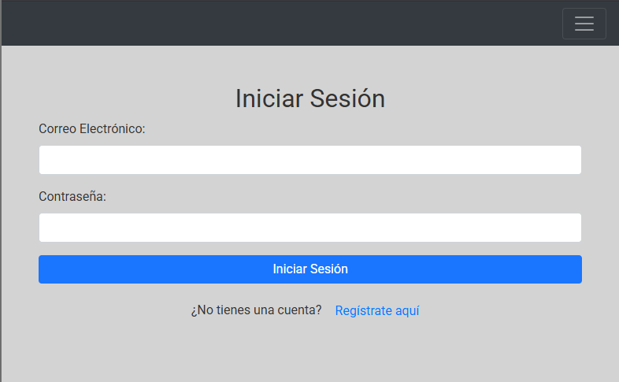
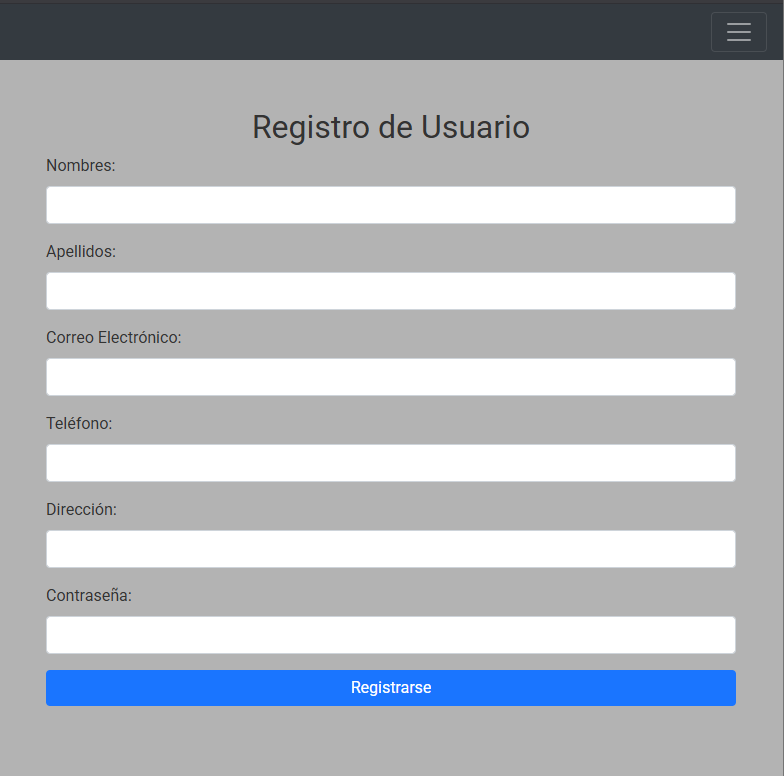
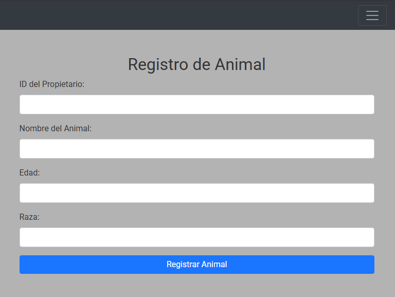
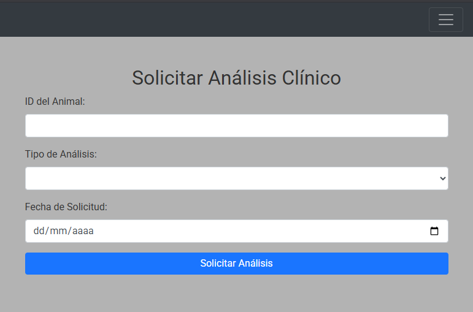
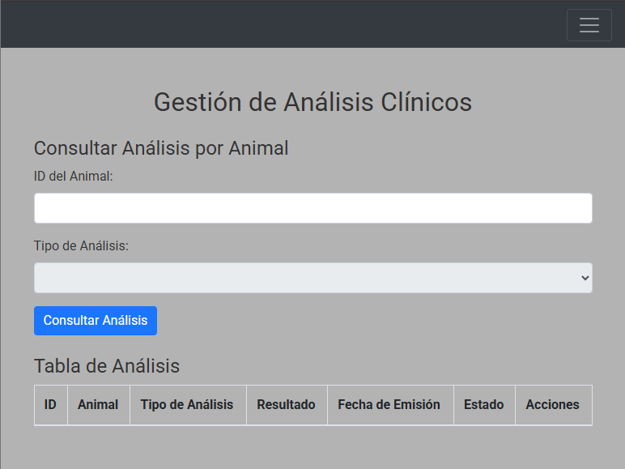

# Aplicación Web para la Gestión Integral de Servicios de Laboratorio Veterinario para Districampo

Este proyecto se centra en crear una aplicación web para la gestión integral de servicios de laboratorio veterinario, con el objetivo de optimizar los procesos de diagnóstico y mejorar la eficiencia y trazabilidad de los mismos.

### Características Principales

Tu plataforma integral de gestión de laboratorio veterinario ofrece las siguientes funcionalidades clave:

* **Gestión de Usuarios:**
    * Registro y autenticación segura para propietarios de animales.
    * Inicio de sesión intuitivo y administración de datos personales.

* **Administración de Mascotas:**
    * Creación, edición y eliminación de perfiles detallados para cada mascota.
    * Asociación de mascotas con sus respectivos propietarios.

* **Solicitud y Seguimiento de Análisis:**
    * Facilidad para solicitar diversos servicios de laboratorio veterinario.
    * Seguimiento en tiempo real del estado de cada análisis solicitado.
    * Acceso a un historial completo de exámenes por cada mascota y especie.

* **Entrega Digital de Resultados:**
    * Carga eficiente de resultados por parte de los laboratorios aliados.
    * Generación automática de reportes en formato PDF.
    * Acceso digital y seguro a los resultados para los propietarios.

* **Módulo Administrativo:**
    * Control integral de citas y servicios agendados.
    * Auditoría detallada de datos y procesos para la tienda agropecuaria.

### Vistas de la Interfaz de Usuario (Mockups Visuales)

A continuación, se presentan capturas de pantalla de las interfaces clave de la aplicación, mostrando el diseño y la interacción propuesta:

#### Vista de Inicio de Sesión


Permite a un usuario registrado acceder a su panel personalizado y funcionalidades de la aplicación.

#### Vista de Registro de Usuario


Facilita la creación de una nueva cuenta para que un usuario acceda a los servicios de la plataforma.

#### Vista del Dashboard Principal


Ofrece una visión general personalizada al usuario, sirviendo como punto de acceso a las diferentes funcionalidades.

#### Vista de Registro de Animales


Permite a un propietario añadir y gestionar la información de sus mascotas en el sistema.

#### Vista de Solicitud de Análisis


Guía al propietario en el proceso de agendar una cita para la recolección de muestras a domicilio.

#### Vista de Gestión de Análisis


Permite al propietario verificar el progreso de sus muestras enviadas y acceder a los informes digitales en PDF de los laboratorios.

También y como un extra, contamos con el que fue el primer diseño/Mockup de la idea de este proyecto hecho en figma, se puede observar allí la idea principal de una web para gestionar todo el proceso del laboratorio integral de forma digital, registrando usuarios, seleccionando analisis, entre otras opciones, a continuacion el link para acceder a este primer diseño:

A continuación, puedes acceder a este primer diseño: [Primer Diseño/Mockup en Figma](https://www.figma.com/design/GJd71HrW1hT4HkcOGHroiP/LABORATORIO-VETERINARIO?fuid=1261774445390314027)

### Diagrama General (Flujo de uso del software)
La aplicación se basa en una arquitectura de software en capas para asegurar la modularidad, escalabilidad y una clara separación de responsabilidades. Una representación visual de esta arquitectura es la siguiente:


### Diagrama General del Proyecto (Estructura en Capas)
Este diagrama ilustra la arquitectura de software en capas de la aplicación.
Muestra cómo las distintas partes de la aplicación interactúan, desde la interfaz de usuario hasta la base de datos, facilitando su desarrollo y mantenimiento.


## Estructura de la Base de Datos

La estructura completa de la base de datos se encuentra definida en el archivo `docs/database/schema.sql`. Este script contiene la definición de todas las tablas, sus columnas, tipos de datos, claves primarias y foráneas, y todas las restricciones necesarias para recrear la base de datos `veterilab2`.

### Modelo Entidad-Relación (MER)
El Modelo Entidad-Relación proporciona una vista conceptual de las entidades principales de la base de datos y sus relaciones, ilustrando la organización lógica de los datos.


### Modelo Relacional
El Modelo Relacional detalla la estructura física de las tablas de la base de datos, incluyendo columnas, claves primarias, claves foráneas, tipos de datos y relaciones.


## Configuración del Entorno de Desarrollo y Ejecución

Para poner en marcha el proyecto localmente y empezar a desarrollar, hay que configurar el entorno de desarrollo:

### Estructura del Repositorio
El repositorio principal (`gestion-veterinaria-districampo` en GitHub) contiene la siguiente estructura básica:

* `/backend/`: Código del servidor (Node.js/Express.js).
* `/frontend/`: Código del cliente (HTML, CSS, JavaScript, Bootstrap).
* `/docs/`: Documentación del proyecto, incluyendo:
    * `/docs/architecture/`: Diagramas de arquitectura y flujo (ej. `diagrama-captura.png`, `diagrama-capas.png`).
    * `/docs/database/`: Esquema de la base de datos (`schema.sql`, `mer.png`, `modelo-relacional.png`).
* `.gitignore`: Para excluir archivos no deseados (como `node_modules/` o `.env`).
* `README.md`: Este archivo de descripción del proyecto.

### Pasos para la Configuración Local

1.  **Clonar el repositorio:**
    ```bash
    git clone [https://github.com/Andrew06G/gestion-veterinaria-districampo.git](https://github.com/Andrew06G/gestion-veterinaria-districampo.git)
    cd gestion-veterinaria-districampo
    ```

2.  **Instalar Dependencias del Backend:**
    ```bash
    cd backend
    npm install
    ```

3.  **Configurar la Base de Datos:**
    * Asegúrate de tener MySQL instalado y funcionando.
    * Crea una nueva base de datos llamada `veterilab2`.
    * Importa el esquema de la base de datos utilizando el archivo `docs/database/schema.sql`. Puedes hacerlo desde tu gestor de base de datos (MySQL Workbench, phpMyAdmin) o desde la línea de comandos:
        ```bash
        mysql -u tu_usuario_mysql -p veterilab2 < docs/database/schema.sql
        ```
        (Reemplaza `tu_usuario_mysql` con tu usuario de MySQL).

4.  **Configurar Credenciales del Backend:**
    * En la carpeta `backend/`, edita el archivo `.env` (o `.env.example` y renómbralo a `.env` si no existe). Incluye tus credenciales de conexión a la base de datos MySQL local:
        ```
        DB_HOST=localhost
        DB_USER=tu_usuario_mysql
        DB_PASSWORD=tu_contraseña_mysql
        DB_NAME=veterilab2
        ```
        (Reemplazar `tu_usuario_mysql` y `tu_contraseña_mysql` con los datos de tu configuración local de MySQL).

### Ejecución del Proyecto

1.  **Iniciar el Servidor del Backend:**
    Desde la carpeta `backend/`:
    ```bash
    npm start
    ```

2.  **Configuración del Frontend:**
    ```bash
    cd frontend
    # Dependiendo de tu setup de frontend, podrías no necesitar npm install aquí.
    # Si tus archivos HTML/CSS/JS son estáticos, simplemente ábrelos con un navegador.
    # Si usas un servidor de desarrollo para el frontend (ej. Live Server en VS Code), inícialo.
    ```

## Tecnologías Utilizadas

* **Backend:** Node.js, Express.js (lógica de negocio y API)
* **Base de datos:** MySQL
* **Frontend:** HTML, CSS, JavaScript, Bootstrap
* **Generación de reportes PDF:** PDFKit
* **Consumo de API:** Axios
* **Control de versiones:** Git, GitHub
* **Entorno de desarrollo:** Visual Studio Code
* **Pruebas de API:** Postman
* **Despliegue:** AWS Lightsail (instancia básica)

    (Actualmente no se ha subido el codigo, en una futura actualización estara disponible dicho archivo, y tambien toda la logica del FonrtEnd y el BackEnd para poner a funcionar todo el proyecto siguiendo las indicaciones)

## Contribuciones

Este es un proyecto académico desarrollado por:

* DAVID RICARDO RIVERA ARBELAEZ
* DANIEL FELIPE COLORADO AMAYA
* ANDREW LOAIZA GUZMAN

## Licencia

Todos los derechos reservados. Este proyecto es para fines académicos y no se permite su uso o distribución comercial sin autorización expresa.